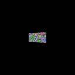
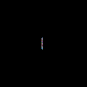
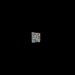
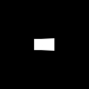
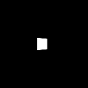

# Pytorch-image-3D-transformer

This repository utilizes the torchvision.transforms.functional.perspective function to transform adversarial patches within a 3D space, which maintain differentiability with respect to the original image, making it particularly useful for creating patches that are effective in deceiving 3D vision models.

## Patch
  
 

## Mask
  
 
